# 植物单细胞分析完整流程图

## 总体流程

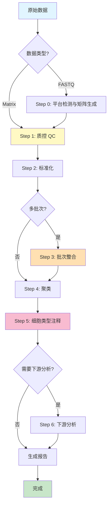

## Step 0: 平台检测与矩阵生成

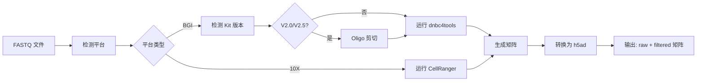

## Step 1: 质控 (QC)

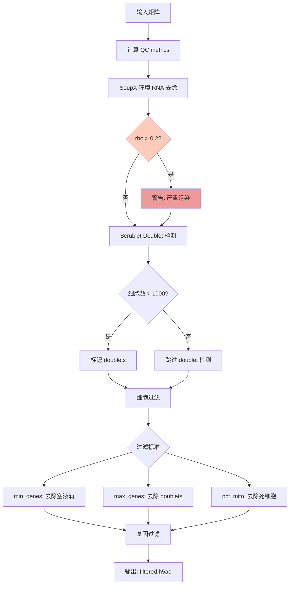

## Step 2: 标准化

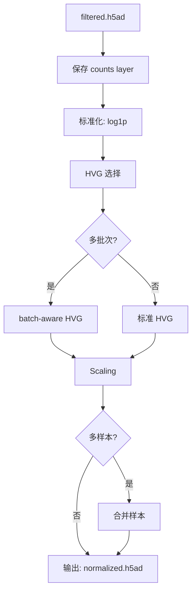

## Step 3: 批次整合 (可选)

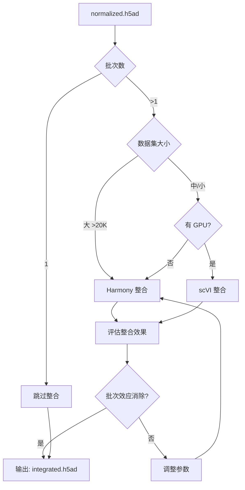

## Step 4: 聚类

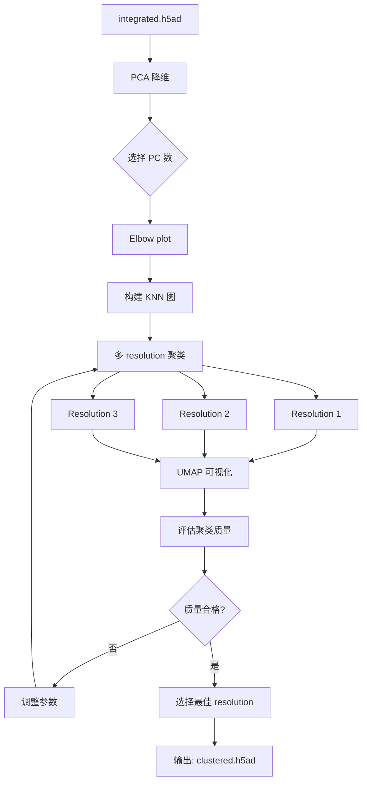

## Step 5: 细胞类型注释

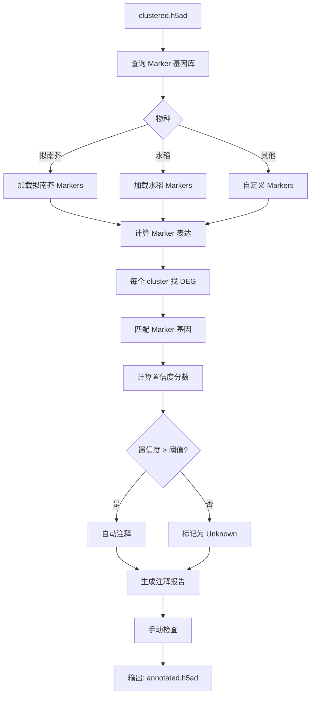

## Step 6: 下游分析 (可选)

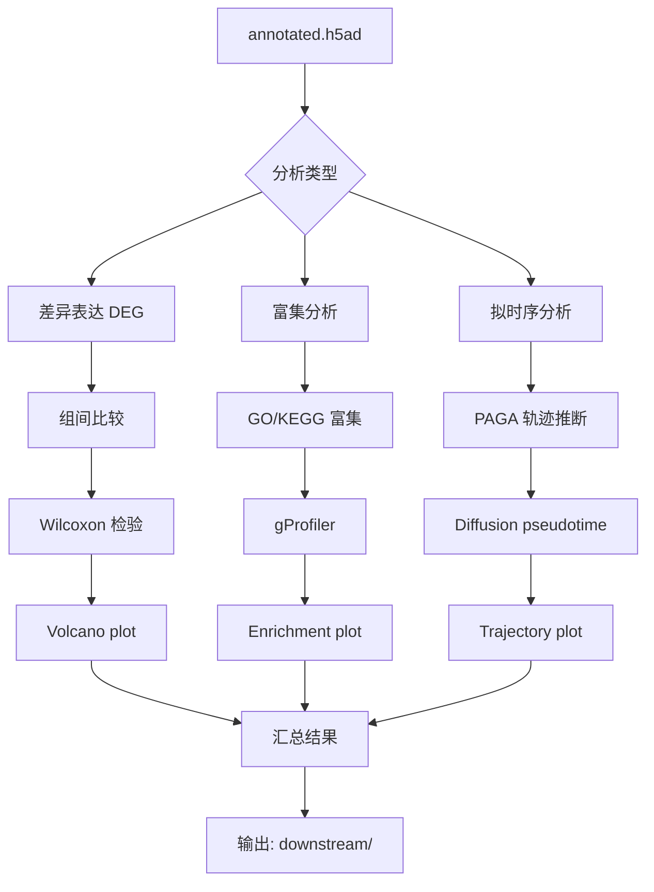

## Agent 决策流程

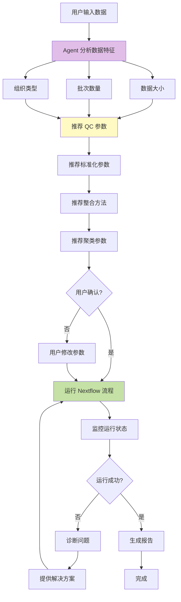

## 质量检查点

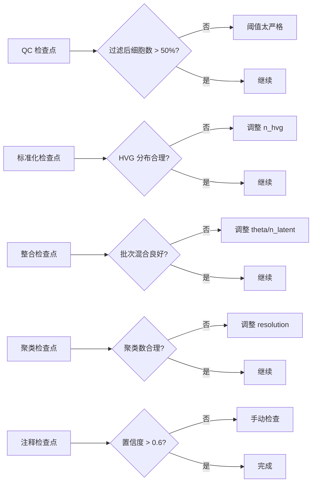

## 文件流转图

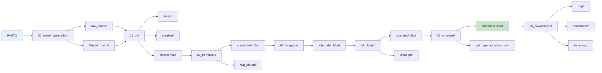

---

## 使用说明

这些流程图展示了：
1. **总体流程** - 完整的分析步骤
2. **各步骤详细流程** - 每个步骤的内部逻辑
3. **Agent 决策流程** - 智能推荐系统如何工作
4. **质量检查点** - 关键的质量控制节点
5. **文件流转** - 数据如何在各步骤间传递

可以用 Mermaid 渲染这些图表，或者导出为 PNG/SVG 格式。
